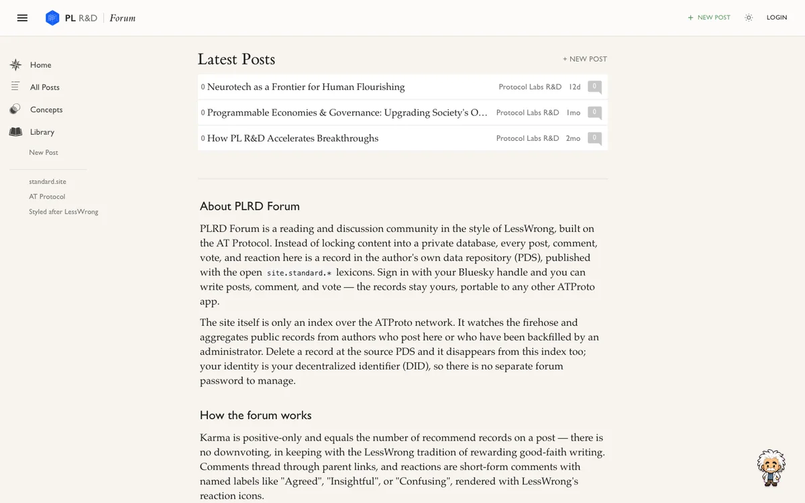

# Open Lab

A research forum with the reading experience of LessWrong, the Open Lab visual identity, and accounts built on ATProto.

Open Lab (by PL R&D) is a shared place for PL R&D and its collaborators to publish, discuss, and follow research. Posts and discussions live in their authors' personal data servers. The forum indexes those public records and gives them a familiar reading interface.

[Visit the forum](https://plrd-forum.vercel.app) · [Sign in](https://plrd-forum.vercel.app/login) · [API documentation](https://plrd-forum.vercel.app/docs) · [Guide for coding agents](AGENTS.md)



## What you can do

- **Read without an account.** Browse recent posts, publications, author profiles, and topics.
- **Sign in with email or an ATProto handle.** Email is the default. Existing Bluesky and other ATProto accounts work through the alternative handle form.
- **Publish and discuss.** Write rich-text posts, add threaded comments, recommend posts, subscribe to publications, and react to selected passages.
- **Keep your records.** Publishing writes to your own PDS, the personal data server behind your ATProto account. The forum's database is an index, not the source of your posts.
- **Read comfortably.** Newsreader serif text, Aileron UI type, light and dark themes, a reading-progress rail, and author and link previews. The layout follows LessWrong; the palette and sign-in screen follow the Open Lab design.

The interface is adapted from [ForumMagnum](https://github.com/ForumMagnum/ForumMagnum). This is a separate Next.js application, not a deployment of LessWrong's backend.

## Run it locally

You need Node.js 22 or newer, npm, and access to the internet for ATProto services. SQLite runs locally; you do not need a separate database server. Its native dependency may require compiler tools if a prebuilt binary is unavailable on your platform.

```bash
git clone https://github.com/daviddao/plrd-forum.git
cd plrd-forum
npm ci
cp .env.example .env.local
openssl rand -hex 32
```

Paste the generated value into `SESSION_SECRET` in `.env.local`, then start the app:

```bash
npm run dev
```

Open **http://127.0.0.1:3457**. Use that exact origin: OAuth callbacks depend on it matching `PUBLIC_URL`.

The example configuration seeds an empty index from `plrd.org`. Seeding reads existing public records and never publishes new posts. To index another author:

```bash
curl -X POST http://127.0.0.1:3457/api/backfill \
  -H 'Content-Type: application/json' \
  -d '{"actor":"plrd.org"}'
```

### Configuration

The checked-in [`.env.example`](.env.example) contains public defaults and an empty secret field. Keep actual values in `.env.local` or your hosting provider's environment settings.

| Variable | Purpose |
| --- | --- |
| `SESSION_SECRET` | Required. A random value of at least 32 characters encrypts session and OAuth cookies. There is no fallback password. |
| `PUBLIC_URL` | The exact origin people visit. Use `http://127.0.0.1:3457` locally and your HTTPS origin in production. |
| `EPDS_URL` | Email sign-in provider. The example uses `https://certified.one`. Without it, handle login still works. |
| `SEED_ACTORS` | Optional comma-separated public handles or DIDs to index when the database is empty. |
| `DATABASE_PATH` | SQLite file path. Defaults to `./forum.db`. Use persistent storage outside demo deployments. |
| `NEXT_PUBLIC_SITE_NAME` | Site name used in the header, titles, and API descriptions. Defaults to `Open Lab`. Inlined at build time. |
| `NEXT_PUBLIC_SITE_URL` | Optional canonical origin for metadata, discovery, and sitemaps. |
| `NEXT_PUBLIC_TYPEKIT_ID` | Optional Adobe Fonts kit for Warnock Pro post bodies. Without it, Newsreader is used. |
| `JETSTREAM_URL` | Optional ATProto event-stream endpoint override. |
| `OAUTH_AUTHORIZE_REWRITES` | Optional JSON map for known provider authorization-host corrections. Normally leave unset. |

Anything named `NEXT_PUBLIC_*` is visible to browsers. Never put a token, password, or private key there. See [SECURITY.md](SECURITY.md).

### How sign-in works

Email sign-in redirects to the configured ePDS provider, which verifies the email and handles account creation. The forum never asks for an email password. Handle sign-in redirects to the account's ATProto provider instead.

Both paths use the same ATProto OAuth callback. The forum session identifies the user by DID; it does not store the login email. OAuth state, tokens, and DPoP key material are stored in encrypted, HTTP-only cookies.

## How the data works

```text
Author's ATProto PDS
        │ public records
        ▼
Jetstream events + on-demand backfill
        │
        ▼
Local SQLite index
        │
        ▼
Next.js pages, JSON API, and read-only MCP tools
```

New posts use [standard.site](https://standard.site) records with [Leaflet](https://leaflet.pub)-compatible content blocks. Older Leaflet records remain readable.

| Content | Record type |
| --- | --- |
| Posts | `site.standard.document` |
| Publications | `site.standard.publication` |
| Post recommendations | `site.standard.graph.recommend` |
| Publication subscriptions | `site.standard.graph.subscription` |
| Comments and quote reactions | `pub.leaflet.comment` |

Recommendations are positive-only. Comment votes still use Leaflet's legacy recommendation lexicon. When both a legacy record and its standard.site replacement exist, the standard.site record is canonical.

The index deliberately does not import the entire standard.site firehose. It accepts those events from known authors to avoid flooding the forum with RSS-bridge content. Profile visits, post visits, and backfill requests can bring new authors into the index.

The local index also stores feedback submitted through the Einstein widget. That feedback is not a public ATProto post.

## For integrations

- [JSON API guide](https://plrd-forum.vercel.app/docs) and [OpenAPI schema](https://plrd-forum.vercel.app/openapi.json)
- [Agent discovery text](https://plrd-forum.vercel.app/llms.txt)
- Read-only MCP endpoint: `https://plrd-forum.vercel.app/.well-known/mcp`
- Markdown responses for supported page routes using `Accept: text/markdown`

`AGENTS.md` is for agents changing this repository. `public/llms.txt` describes the running forum to agents reading its content.

## Development

```bash
npm run dev           # Development server on port 3457
npm run build         # Production build, including TypeScript checks
npx tsc --noEmit      # Type check
npm test              # Session-secret safety tests
npm run lint          # Full lint check
```

With a configured server running:

```bash
LOGIN_TEST_BASE_URL=http://127.0.0.1:3457 npm run test:login
```

The login checks exercise validation and OAuth redirects. They stop before the provider's browser code can send a verification email; they are not a complete OTP sign-in test.

Some existing files have lint findings. Check the affected files as well as the full build, and do not disable lint rules to conceal unrelated failures.

```text
src/app/           Pages, OAuth routes, and HTTP endpoints
src/components/    Forum UI and editor
src/lib/auth/      OAuth and encrypted cookie storage
src/lib/db/        SQLite schema and initialization
src/lib/ingest/    Jetstream, backfill, and record normalization
src/lib/leaflet/   Content blocks, rich text, and rendering
src/lib/queries.ts Read queries used by pages and APIs
scripts/           Tests
```

## Deployment

**Use a persistent Node.js host for a durable community.** SQLite needs a persistent volume, and Jetstream needs a running process. Build with `npm run build`, start with `npm start`, and configure `PUBLIC_URL`, `SESSION_SECRET`, `EPDS_URL`, and `DATABASE_PATH` for that host.

The linked Vercel site is a demo. On Vercel, set `DATABASE_PATH=/tmp/forum.db` and configure seed authors. Each cold instance can start with an empty database, and Jetstream is not a persistent worker. Backfill makes published PDS content readable again, but local-only feedback is not durable there.

The included GitHub Actions workflow deploys only when `VERCEL_TOKEN`, `VERCEL_ORG_ID`, and `VERCEL_PROJECT_ID` are configured as repository secrets. A new clone or fork does not inherit them. You can also link your own Vercel project and run `npx vercel --prod`.

Local development needs no paid application subscription, excluding your machine and network. Production costs depend on compute, storage, traffic, and your PDS/email provider. This project does not include a measured production cost estimate.

## Contributing

Read [AGENTS.md](AGENTS.md) for the implementation rules. In particular, port visual changes from ForumMagnum source rather than approximating them, preserve compatibility with existing PDS records, and check both desktop and mobile layouts.

Please report security issues privately rather than including credentials or session data in an issue.

## Attribution and licensing

ForumMagnum supplies the visual design and source adaptations used here. Its upstream license is GNU GPL version 3; a copy is included in [LICENSES/ForumMagnum-GPL-3.0.txt](LICENSES/ForumMagnum-GPL-3.0.txt).

See [THIRD_PARTY_NOTICES.md](THIRD_PARTY_NOTICES.md) for sources and asset notes. Public access to this repository does not grant separate rights to third-party branding, artwork, or commercial fonts.
